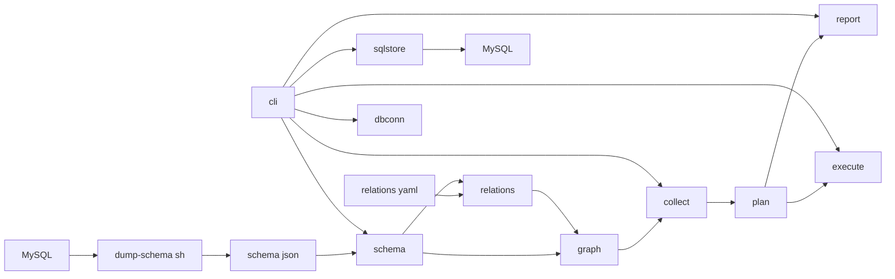
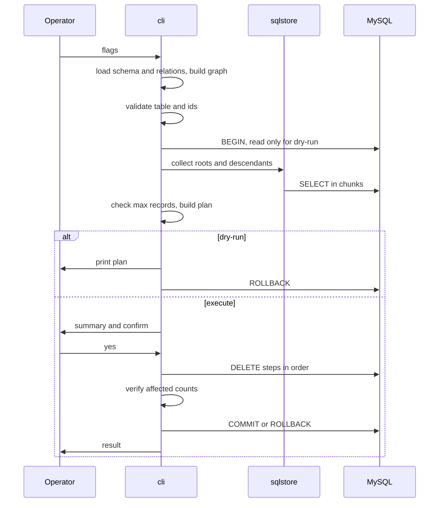

# Design Document: mysql-relation-deleter

## Overview
**Purpose**: MySQL の運用者に対して、指定したレコードと、それを直接・間接に参照するすべての子孫レコードを、漏れなく正しい順序で安全に削除する手段を提供する。
**Users**: 開発者・運用担当者が、テストデータや退会ユーザーなど特定エンティティに紐づくデータを一括削除するときに使う。
**Impact**: greenfield。新規に次の2つを作る。
- ダンプスクリプト `scripts/dump-schema.sh`
- Go CLI `relation-deleter`

全体は「スキーマファイル（JSON）→ 参照グラフ → 収集 → 削除計画 → 表示 / 実行」というパイプラインで、dry-run と execute は同じ削除計画（`Plan`）を共有する。

### Goals
- スキーマ構造（テーブル・カラム・PK・FK）を、決定的な順序のスキーマファイルとして出力する（1.1–1.6）
- FK 制約と手動リレーション定義を統合した参照グラフで、子孫レコードを漏れなく重複なく収集する（2.x, 4.x）
- 既定は無変更のプレビューとし、明示的な指定と確認を経た場合だけ、1トランザクションで全件まとめて削除する（5.x, 6.x）
- 件数上限・大量データ・認証情報の安全性を満たす（7.x, 8.x, 9.x）

### Non-Goals
- 条件式による削除起点の指定、ON DELETE ルールに応じた挙動の切り替え、命名規約からの推測
- バックアップ / リストア、スキーマ変更、MySQL 以外の DB、GUI、JSON 形式の結果出力

## Boundary Commitments

### This Spec Owns
- スキーマファイルのフォーマット（`format_version: 1`）と、その生成スクリプト
- 手動リレーション定義ファイルのフォーマット（`version: 1`）と、その検証
- 参照グラフの構築、子孫レコードの収集、削除順序の決定、削除文の生成、トランザクション内での実行と件数検証
- CLI のフラグ体系、出力（計画・進捗・結果）、終了コード
- 認証情報の受け取り方（環境変数 `MYSQL_PWD`、option file）

### Out of Boundary
- スキーマファイルを現行 DB と自動で同期すること（運用者の責任。不一致は実行時エラー → ロールバックで扱う）
- 対象スキーマ外（別データベース）のテーブルから参照されているケースの収集（FK エラー → ロールバックで安全側に倒す）
- 削除前データの退避、監査ログの永続化
- 収集から削除までの間に、FK のない関連で同時挿入された子レコードの検出

### Allowed Dependencies
- MySQL 5.7.8+ / 8.0 の両方を正式にサポートする（`information_schema`、`JSON_OBJECT`、`GROUP_CONCAT`、session の `foreign_key_checks`、`START TRANSACTION READ ONLY`）。どちらか一方にしかない機能（8.0 の CTE、ウィンドウ関数、`utf8mb4_0900_*` 照合順序など）は使わない
- `mysql` CLI クライアント（ダンプスクリプトだけが使う）
- Go 1.24+ の標準ライブラリ、`github.com/go-sql-driver/mysql` v1.10.x、`go.yaml.in/yaml/v3`
- 依存方向（逆向きの import は禁止）:
  `schema` → `relations` → `graph` → `collect` → `plan` → `execute` / `report` → `cli` → `cmd`
  - `dbconn` と `sqlstore` は `cli` だけが使う
  - `sqlstore` は `collect.RowSource` の実装で、`schema` と `collect` を import してよい。`execute.Execer` は `*sql.Tx` がそのまま満たす

### Revalidation Triggers
- スキーマファイルのフォーマット変更（`format_version` の更新）→ スクリプトと `schema` パッケージを同時に更新し、ゴールデンファイルを再生成する
- 手動リレーション定義フォーマットの変更 → `relations` パッケージとサンプルを更新する
- 終了コードやフラグの変更 → 呼び出し側のスクリプトに影響する
- 最小 MySQL / Go バージョンの変更

## Architecture

### Architecture Pattern & Boundary Map
採用するのはパイプライン構成で、各段は純粋なデータを受け渡し、副作用は端に寄せる。



**Architecture Integration**:
- **境界**: ダンプ（bash）と削除（Go）は、スキーマファイルを唯一の契約にして分離する
- **DB との接点**: Go 側で DB に触れるのは `sqlstore`（SQL の発行）と `dbconn`（接続）だけ。`collect` と `execute` は interface に依存するので、DB なしで単体テストできる
- **steering への準拠**:
  - 安全側デフォルト（dry-run が既定）
  - 値はプレースホルダで渡し、識別子はスキーマにあるものだけを使う
  - 認証情報はプロセス引数に載せない
  - `cmd` は薄く保つ

### Technology Stack

| Layer | Choice / Version | Role in Feature | Notes |
|-------|------------------|-----------------|-------|
| CLI | Go 1.24+（開発は 1.27.1、asdf `.tool-versions`）、標準 `flag` | 削除コマンド | `go.mod` は `go 1.24` |
| Data access | `github.com/go-sql-driver/mysql` v1.10.x | DB ドライバ | MPL-2.0。DSN は `mysql.Config` で組み立てる |
| Config | `go.yaml.in/yaml/v3` | 手動リレーション定義の読み込み | `yaml.Node` の行番号をエラー表示に使う |
| Dump | Bash 3.2+、`mysql` CLI 8.0 | スキーマの JSON 出力 | `-N -B -r`、`group_concat_max_len` を引き上げる |
| Test infra | Docker（`mysql:5.7` と `mysql:8.0` を並行して起動） | 結合テスト | build tag `integration`。`mysql:5.7` は amd64 イメージしかないため `platform: linux/amd64`（Apple Silicon ではエミュレーション） |

## File Structure Plan

### Directory Structure
```
.
├── go.mod                              # module github.com/yamagame/mysql-relation-deleter, go 1.24
├── .tool-versions                      # golang 1.27.1（作成済み）
├── cmd/relation-deleter/
│   └── main.go                         # cli.Run(…, cli.DefaultDeps()) を呼び、その戻り値で os.Exit するだけ
├── scripts/
│   └── dump-schema.sh                  # Schema Dump Script（要件 1, 9）
├── internal/
│   ├── schema/
│   │   ├── types.go                    # Schema / Table / Column / ForeignKey 型、IsBinary 判定
│   │   ├── load.go                     # JSON の読み込みと構造検証（format_version、重複、参照整合）
│   │   └── ident.go                    # QuoteIdent: 識別子のバッククォート引用（plan と sqlstore が共用）
│   ├── relations/
│   │   ├── types.go                    # ManualRelation 型
│   │   └── load.go                     # YAML の読み込み、行番号付きの検証
│   ├── graph/
│   │   ├── graph.go                    # Edge、Graph の構築（FK＋手動の統合・重複排除）、親から子への索引
│   │   └── order.go                    # Tarjan SCC と削除順（子→親）の決定、循環フラグ
│   ├── collect/
│   │   ├── types.go                    # Tuple、RowKey、Predicate、TableSet、Collection
│   │   ├── source.go                   # RowSource interface
│   │   └── collector.go                # 起点の検証と BFS による子孫収集
│   ├── plan/
│   │   └── plan.go                     # Collection と Graph から Plan（Step、Statement）を生成、チャンク分割
│   ├── execute/
│   │   └── executor.go                 # Execer interface、Plan の実行、件数検証
│   ├── report/
│   │   ├── plan_text.go                # dry-run の計画表示、確認用の要約
│   │   ├── progress.go                 # 進捗表示（stderr）
│   │   └── literal.go                  # 表示専用の SQL リテラル整形（実行には使わない）
│   ├── sqlstore/
│   │   └── source.go                   # RowSource の SQL 実装（SELECT の生成、型に応じたスキャン）
│   ├── dbconn/
│   │   ├── config.go                   # フラグ・環境変数・option file からの接続設定の解決
│   │   └── optionfile.go               # [client] セクションのパース
│   └── cli/
│       ├── flags.go                    # フラグ定義、--id のパース（CSV 形式）
│       ├── run.go                      # Run(args, io, deps) int：全体の進行と終了コードの決定、Deps と DefaultDeps
│       ├── confirm.go                  # TTY 判定と y/N 確認
│       └── usage.go                    # --help の使い方（認証情報の渡し方、制限事項、索引のない手動関連の注意）
├── testdata/
│   ├── integration/
│   │   ├── docker-compose.yml          # mysql57（5.7, linux/amd64）と mysql80（8.0）を別ポートで起動
│   │   └── fixture.sql                 # 複合 PK / FK、自己参照、循環、PK なし、FK なし関連、バイナリキーを含むスキーマとデータ（5.7 / 8.0 共通の構文、照合順序は utf8mb4_unicode_ci を明示）
│   ├── schema.golden.5.7.json          # fixture.sql に対するダンプの期待値（5.7）
│   ├── schema.golden.8.0.json          # 同（8.0）。整数の表示幅などの COLUMN_TYPE 表記がバージョンで異なるため分ける
│   └── relations.sample.yaml           # 手動定義のサンプル
├── integration/
│   └── integration_test.go             # //go:build integration：ダンプスクリプトと CLI の結合テスト
```
各 `internal/*` パッケージは `*_test.go` を同じディレクトリに置き、DB を使わない単体テストを持つ。

### Modified Files
- `.kiro/steering/tech.md` — Go 1.24+ / 開発環境 1.27.1、MySQL 5.7.8+ に更新済み

## System Flows

### 削除コマンドの全体フロー


**フロー上の決定事項**:
- **DB に触れる前に終える検証**: スキーマファイル・リレーション定義・フラグの検証（2.3, 2.4, 3.3, 3.4, 3.7）は、DB 接続の前に完了させる
- **収集から確定までを1トランザクションで**: execute では収集・確認・削除・検証を同じトランザクションで行う。dry-run は `sql.TxOptions{ReadOnly: true}` で収集し、必ずロールバックする
- **件数上限の判定**: 上限チェック（7.1）は収集の直後、表示や確認より前に行う

### 終了コード
| Code | 意味 | 該当要件 |
|------|------|---------|
| 0 | 成功（dry-run の計画表示、または削除完了） | 5.1, 6.8 |
| 1 | 実行時エラー（DB 接続、SQL エラー、削除の失敗、件数不一致） | 6.7, 6.9, 9.3 |
| 2 | 入力・検証エラー（フラグ、スキーマファイル、リレーション定義、テーブルや PK の不一致、対象なし） | 2.3, 2.4, 3.3, 3.4, 3.6, 3.7 |
| 3 | 中止（確認で拒否、件数上限の超過、非対話環境で --yes なし） | 6.2, 6.4, 7.1 |

ダンプスクリプトは、成功で 0、失敗で 1、バージョン不足で 2 を返す。

## Requirements Traceability

| Requirement | Summary | Components | Interfaces | Flows |
|-------------|---------|------------|------------|-------|
| 1.1 | テーブル・カラム・PK の出力 | DumpScript | スキーマファイル `tables[]` | — |
| 1.2 | FK の出力 | DumpScript | `foreign_keys[]` | — |
| 1.3 | データを含めない | DumpScript | — | — |
| 1.4 | 成功時の件数表示 | DumpScript | stderr | — |
| 1.5 | 失敗時に既存ファイルを保護 | DumpScript | 一時ファイル＋`mv` | — |
| 1.6 | バージョン要件 | DumpScript | `SELECT VERSION()` | — |
| 1.7 | 5.7 と 8.0 の両対応 | DumpScript, sqlstore, execute, 結合テスト | 共通構文のみを使う、バージョン別の期待値ファイル | 結合テストの2系統実行 |
| 2.1 | 手動定義を参照関係に加える | relations, graph | `relations.Load`, `graph.Build` | — |
| 2.2 | 手動定義なしは FK のみ | graph | `graph.Build(s, nil)` | — |
| 2.3 | 存在しないテーブル・カラム | relations | `ValidationError{Line}` | DB 接続前 |
| 2.4 | カラム数の不一致 | relations | `ValidationError{Line}` | DB 接続前 |
| 2.5 | FK と重複したら1本にまとめる | graph | `Edge.Sources` | — |
| 3.1 | テーブルと PK で起点を指定 | cli, collect | `--table`, `--id`, `Collector.Collect` | — |
| 3.2 | 複合 PK | cli | `--id` の CSV パース | — |
| 3.3 | テーブルが存在しない | cli | exit 2 | DB 接続前 |
| 3.4 | PK なし・値の数の不一致 | cli | exit 2 | DB 接続前 |
| 3.5 | 一部が存在しない場合は警告 | collect, report | `Collection.MissingRoots` | — |
| 3.6 | すべて存在しない | cli | exit 2 | — |
| 3.7 | スキーマファイルが不正 | schema | `schema.Load` | DB 接続前 |
| 4.1 | 再帰的な収集 | collect | `Collector.Collect` | BFS |
| 4.2 | NULL 許容・ON DELETE を無視 | collect, graph | Edge に削除ルールを持たせない | — |
| 4.3 | 重複排除と探索の終了 | collect | `TableSet` の RowKey 集合 | — |
| 4.4 | PK なしの子テーブル | collect, plan | 全カラムタプル＋件数、述語での DELETE | — |
| 4.5 | PK 以外を参照する関連 | collect | `Edge.ParentColumns` の値で辿る | — |
| 4.6 | 収集中は変更しない | cli, sqlstore | SELECT のみ、dry-run は READ ONLY トランザクション | — |
| 5.1 | 既定は dry-run | cli | `--execute` なし → ロールバック | dry-run |
| 5.2 | 削除順にテーブル別の件数と PK | report | `RenderPlan` | — |
| 5.3 | 削除文の表示 | report, plan | `Statement`, `literal` | — |
| 5.4 | 総件数とテーブル数 | report | `RenderPlan` | — |
| 5.5 | どの関連で対象になったか | collect, report | `TableSet.Via` | — |
| 6.1 | 要約を表示して確認 | cli, report | `RenderSummary`, `confirm` | execute |
| 6.2 | 拒否なら変更しない | cli | ロールバック、exit 3 | — |
| 6.3 | --yes で確認を省略 | cli | `--yes` | — |
| 6.4 | 非対話環境で --yes なし | cli | `isTerminal`、exit 3 | — |
| 6.5 | 子→親の順で1単位として確定 | graph, plan, execute | `graph.DeleteOrder`, `Executor.Run` | — |
| 6.6 | 自己参照・循環も全件削除 | graph, plan, execute | `Step.Cyclic` で FK チェックを切り替え | — |
| 6.7 | 失敗したら取り消し | execute, cli | `ExecError{Table}`、ロールバック | — |
| 6.8 | 実削除件数の表示 | report | `RenderResult` | — |
| 6.9 | 件数不一致で取り消し | execute | `CountMismatchError` | — |
| 7.1 | 上限を超えたら中止 | cli | `--max-records` | 収集直後 |
| 7.2 | 上限なし | cli | 既定値 0 は無制限 | — |
| 8.1 | 1文のサイズ上限を回避 | plan, sqlstore | `--chunk-size`（既定 500）、プレースホルダ上限による縮小 | — |
| 8.2 | 進捗表示 | report | `Progress`（stderr） | — |
| 9.1 | パスワードを引数で受け取らない | dbconn, DumpScript | `MYSQL_PWD`, `--defaults-file` | — |
| 9.2 | パスワードを出力しない | dbconn, report | `Config.Redacted()` | — |
| 9.3 | 接続失敗時の表示 | cli, dbconn | exit 1 | — |

## Components and Interfaces

| Component | Domain/Layer | Intent | Req Coverage | Key Dependencies | Contracts |
|-----------|--------------|--------|--------------|------------------|-----------|
| DumpScript | Script | DB → スキーマファイル | 1.x, 9.1, 9.2 | mysql CLI (P0) | Batch |
| schema | Input | スキーマファイルの型と読み込み | 3.7 | — | Service |
| relations | Input | 手動定義の読み込みと検証 | 2.1, 2.3, 2.4 | schema (P0), yaml (P0) | Service |
| graph | Domain | 参照グラフと削除順 | 2.1, 2.2, 2.5, 4.2, 6.5, 6.6 | schema, relations (P0) | Service |
| collect | Domain | 起点の検証と子孫の収集 | 3.1, 3.5, 4.x, 5.5 | graph (P0), RowSource (P0) | Service |
| plan | Domain | 削除計画と削除文の生成 | 4.4, 5.3, 6.5, 6.6, 8.1 | collect, graph (P0) | Service |
| execute | Domain | 計画の実行と件数検証 | 6.5–6.7, 6.9 | plan (P0), Execer (P0) | Service |
| report | Presentation | 計画・要約・結果・進捗の表示 | 3.5, 5.2–5.5, 6.1, 6.8, 8.2 | plan, collect (P1) | Service |
| sqlstore | Adapter | RowSource / Execer の SQL 実装 | 4.6, 8.1 | database/sql (P0) | Service |
| dbconn | Adapter | 接続設定の解決と DSN の生成 | 9.x | mysql driver (P0) | Service |
| cli | Entry | フラグ・進行・確認・終了コード | 3.x, 5.1, 6.1–6.4, 7.x | 全パッケージ (P0) | Service |

### Script

#### DumpScript（`scripts/dump-schema.sh`）

| Field | Detail |
|-------|--------|
| Intent | 対象 DB のスキーマ構造を、決定的な順序のスキーマファイルとして出力する |
| Requirements | 1.1, 1.2, 1.3, 1.4, 1.5, 1.6, 9.1, 9.2 |

**Contracts**: Batch [x]

##### Batch / Job Contract
- **Trigger**: `dump-schema.sh -h HOST -P PORT -u USER -D DATABASE -o OUTPUT [--defaults-file FILE]`
- **パスワード**: 環境変数 `MYSQL_PWD` または `--defaults-file` で渡す。`-p` オプションは用意しない
- **処理**:
  1. `MYSQL_PWD` が与えられたら、`mktemp` で mode 600 の option file を作って `[client] password=...` を書き、`unset MYSQL_PWD` する。`trap ... EXIT` で必ず削除する
  2. `SELECT VERSION()` を実行し、5.7.8 未満なら終了コード 2 で終了する。MariaDB はサポート対象外として警告する
  3. `SET SESSION group_concat_max_len = 67108864` を設定する
  4. テーブルごとに1行ずつ取得する: `information_schema.TABLES`（`TABLE_TYPE='BASE TABLE'`）、`COLUMNS`、`KEY_COLUMN_USAGE`（`CONSTRAINT_NAME='PRIMARY'`）から `JSON_OBJECT(...)` を作り、カラム配列は `GROUP_CONCAT(... ORDER BY ORDINAL_POSITION)` で組み立てる。行は `TABLE_NAME` 順
  5. FK ごとに1行ずつ取得する: `REFERENTIAL_CONSTRAINTS` と `KEY_COLUMN_USAGE` から、`REFERENCED_TABLE_SCHEMA = 対象DB` のものだけを取る。カラム順は `ORDINAL_POSITION`、行は `(TABLE_NAME, CONSTRAINT_NAME)` 順
  6. bash でヘッダとフッタを付けて行をカンマで連結し、出力先と同じディレクトリの一時ファイルに書き出す。成功したら `mv` で置き換える
- **Output**: スキーマファイル（Data Models を参照）。stderr に `tables=N foreign_keys=M` を出す
- **Idempotency & recovery**: 途中で失敗したら一時ファイルを削除し、既存の出力は変更しない（1.5）。同じスキーマからは同じ内容のファイルが出る
- **終了コード**: 0 成功、1 接続・取得の失敗、2 バージョン不足・引数の誤り

**Implementation Notes**
- **mysql の呼び出し**: 常に `--defaults-extra-file`（ある場合）、`-N -B -r` の順で引数を組み立てる。エラー出力はそのまま stderr に流す（パスワードは含まれない）
- **検証**: `bash -n` と shellcheck にかける。結合テストでゴールデンファイルと比較する
- **リスク**: `generated_at` は差分ノイズになるので含めない。代わりに `server_version` を入れる

### Input

#### schema

| Field | Detail |
|-------|--------|
| Intent | スキーマファイルを型付きの構造に読み込み、構造の整合を検証する |
| Requirements | 3.7（他の全要件の前提） |

**Contracts**: Service [x]

##### Service Interface
```go
package schema

type Column struct {
    Name     string `json:"name"`
    Type     string `json:"type"`     // COLUMN_TYPE の値（例: "bigint unsigned", "binary(16)"）
    Nullable bool   `json:"nullable"`
}

type Table struct {
    Name       string   `json:"name"`
    Columns    []Column `json:"columns"`     // ORDINAL_POSITION 順
    PrimaryKey []string `json:"primary_key"` // 空なら PK なし
}

type ForeignKey struct {
    Name              string   `json:"name"`
    Table             string   `json:"table"`
    Columns           []string `json:"columns"`
    ReferencedTable   string   `json:"referenced_table"`
    ReferencedColumns []string `json:"referenced_columns"`
    DeleteRule        string   `json:"delete_rule"` // 表示専用。挙動には使わない（4.2）
}

type Schema struct {
    FormatVersion int          `json:"format_version"` // 1
    Database      string       `json:"database"`
    ServerVersion string       `json:"server_version"`
    Tables        []Table      `json:"tables"`
    ForeignKeys   []ForeignKey `json:"foreign_keys"`
}

func Load(path string) (*Schema, error)            // 読み込みと Validate
func (s *Schema) Table(name string) (*Table, bool)
func (t *Table) Column(name string) (*Column, bool)
func (c Column) IsBinary() bool                    // binary/varbinary/*blob/bit
func QuoteIdent(name string) string                // `name`。内部のバッククォートは二重化する
```
- **Preconditions**: `path` は読み込み可能なファイル
- **Postconditions**: 返り値の `Schema` は次を満たす
  - `FormatVersion == 1`
  - テーブル名が一意で、各テーブルのカラム名も一意
  - PK と FK のカラムがすべて実在する
  - FK のカラム数が親子で一致する
- **Errors**: `*LoadError{Path, Reason}`。cli はこれを exit 2 に対応させる

#### relations

| Field | Detail |
|-------|--------|
| Intent | 手動リレーション定義を読み込み、スキーマに照らして行番号付きで検証する |
| Requirements | 2.1, 2.3, 2.4 |

**Contracts**: Service [x]

##### Service Interface
```go
package relations

type Endpoint struct {
    Table   string   `yaml:"table"`
    Columns []string `yaml:"columns"`
}

type ManualRelation struct {
    Name   string   `yaml:"name"` // 任意。省略時は "manual#<index>"
    Child  Endpoint `yaml:"child"`
    Parent Endpoint `yaml:"parent"`
    Line   int      `yaml:"-"`    // 定義の開始行
}

type ValidationError struct {
    Path    string
    Line    int
    Message string // 例: "child.columns[1] \"user_id\" not found in table \"orders\""
}

type ValidationErrors []ValidationError // error を実装。全件を列挙する

func Load(path string, s *schema.Schema) ([]ManualRelation, error)
```
- **Preconditions**: `s` は `schema.Load` 済み
- **Postconditions**: 返す定義は、すべてのテーブルとカラムが `s` に実在し、`len(Child.Columns) == len(Parent.Columns) > 0` を満たす
- **未知のキー**: `KnownFields(true)` でエラーにする（タイプミスで関連が抜けるのを防ぐ）

### Domain

#### graph

| Field | Detail |
|-------|--------|
| Intent | FK と手動定義を統合した参照グラフを作り、子→親の削除順と循環群を決める |
| Requirements | 2.1, 2.2, 2.5, 4.2, 6.5, 6.6 |

**Contracts**: Service [x]

##### Service Interface
```go
package graph

type SourceKind int
const (
    SourceForeignKey SourceKind = iota
    SourceManual
)

type EdgeSource struct {
    Kind SourceKind
    Name string // FK の制約名、または手動定義名
}

type Edge struct {
    ID            int
    ChildTable    string
    ChildColumns  []string
    ParentTable   string
    ParentColumns []string
    Sources       []EdgeSource // 同じ関連が重複して定義されていれば複数（2.5）
}

type Graph struct{ /* 非公開: tables, edges, byParent map[string][]*Edge */ }

func Build(s *schema.Schema, manual []relations.ManualRelation) *Graph
func (g *Graph) ChildrenOf(parentTable string) []*Edge
func (g *Graph) ReferencedColumns(table string) [][]string // そのテーブルを親とする各 Edge の ParentColumns

type DeleteGroup struct {
    Tables []string // 同じ強連結成分。名前順
    Cyclic bool     // サイズ2以上、または自己ループあり
}

// DeleteOrder は、指定テーブルに誘導される部分グラフで SCC を求め、子→親の順に並べて返す
func (g *Graph) DeleteOrder(tables []string) []DeleteGroup
```
- **Invariants**:
  - Edge の重複キーは `(ChildTable, ChildColumns, ParentTable, ParentColumns)`。カラム順も含めて比較する
  - ON DELETE ルールは Edge に持たせない（4.2）
  - 出力順は入力順に依存しない（決定的）

#### collect

| Field | Detail |
|-------|--------|
| Intent | 起点を検証し、参照グラフを BFS で辿って、削除対象のレコード集合を作る |
| Requirements | 3.1, 3.5, 4.1, 4.2, 4.3, 4.4, 4.5, 4.6, 5.5, 8.2 |

**Contracts**: Service [x]

##### Service Interface
```go
package collect

// Value は string か []byte（Column.IsBinary に従う）。NULL は nil
type Value = any
type Tuple []Value

// RowKey はタプルを正規化した比較用のキー（長さ付きのバイト連結）
type RowKey string

// Predicate は (Columns) IN (Values...) を表す。Values は NULL を含まない
type Predicate struct {
    Columns []string
    Values  []Tuple
}

type Row struct {
    Values Tuple // 要求したカラムの順
    Count  int64 // PK なしのテーブルで同一行が何件あるか。PK ありは常に 1
}

// RowSource はテーブルから述語に一致する行を取り出す。チャンク分割は実装側の責務
// keyed=false（PK なし）のとき、実装は全カラムで GROUP BY した Row を返す
type RowSource interface {
    Fetch(ctx context.Context, table string, columns []string, keyed bool, p Predicate) ([]Row, error)
}

type RowEntry struct {
    Key    Tuple   // PK 値。PK なしは全カラム値
    Count  int64
    Values map[string]Value // 参照先として使われるカラムの値
}

type ViaEdge struct {
    EdgeID int
    Values []Tuple // PK なしのテーブルで、削除述語に使う親側の値
}

type TableSet struct {
    Table string
    Keyed bool               // PK あり
    Rows  map[RowKey]*RowEntry
    Via   map[int]*ViaEdge   // EdgeID → どの関連で入ったか（5.5）
    Root  bool
}

type Collection struct {
    Tables       map[string]*TableSet
    MissingRoots []Tuple // 3.5
    Total        int64
}

type ProgressFunc func(table string, fetched int64)

type Collector struct {
    Graph    *graph.Graph
    Schema   *schema.Schema
    Source   RowSource
    Progress ProgressFunc
}

func (c *Collector) Collect(ctx context.Context, rootTable string, rootIDs []Tuple) (*Collection, error)
```
- **アルゴリズムの契約**:
  1. 起点を `PrimaryKey` の述語で Fetch する。見つからない ID は `MissingRoots` に入れる
  2. キューからテーブル T の「新しく追加された行」を取り出し、`ChildrenOf(T)` の各 Edge について、新しい行の `ParentColumns` の値（NULL を含むタプルは除く）で、子テーブルを `ChildColumns` 述語で Fetch する
  3. 子の行のうち、RowKey が既出でないものだけを追加してキューに積む
  4. 新しい行がなくなったら終了する（4.3）
- **取得するカラム**: 子を Fetch するときは、PK（PK なしなら全カラム）と `ReferencedColumns(child)` に現れる全カラムを要求する（4.5）
- **PK なしのテーブル**: 行の識別子は全カラムのタプルで、件数は `Count` に持つ。`Via[edge].Values` に述語の値を蓄積し、`plan` はそれを使って削除文を作る（4.4）
- **Postconditions**:
  - `Total` は全 `RowEntry.Count` の合計
  - DB への書き込みは行わない（4.6。RowSource は読み取り専用）
- **Errors**: RowSource のエラーは、テーブル名を付けてラップする

#### plan

| Field | Detail |
|-------|--------|
| Intent | Collection と削除順から、実行順に並んだ削除文の列を作る |
| Requirements | 4.4, 5.3, 6.5, 6.6, 8.1 |

**Contracts**: Service [x]

##### Service Interface
```go
package plan

type Statement struct {
    SQL  string // プレースホルダ付き
    Args []any
}

type Step struct {
    Table      string
    Expected   int64       // このテーブルで削除される件数
    Statements []Statement // チャンクごと
}

type Group struct {
    Cyclic bool // true なら実行時に FK チェックを無効化する
    Steps  []Step
}

type Plan struct {
    Groups     []Group // 子→親の順
    Total      int64
    TableCount int
}

type Options struct {
    ChunkSize int // 既定 500。ChunkSize × カラム数 ≤ 65535 になるように自動で縮める
}

func Build(c *collect.Collection, g *graph.Graph, s *schema.Schema, o Options) (*Plan, error)
```
- **PK ありのテーブル**:
  - 単一カラムの PK: `DELETE FROM `t` WHERE `pk` IN (?,...)`
  - 複合 PK: `DELETE FROM `t` WHERE (`a`,`b`) IN ((?,?),...)`
- **PK なしのテーブル**: `Via` の Edge ごとに `DELETE FROM `t` WHERE (child cols) IN (...)`
- 識別子は `schema.QuoteIdent` で引用する（`sqlstore` と共用する唯一の引用規則）
- **Invariants**:
  - Group 内の Step の順序は、`DeleteGroup.Tables` の順（決定的）
  - `Plan.Total == Collection.Total`

#### execute

| Field | Detail |
|-------|--------|
| Intent | Plan を1トランザクション内で実行し、テーブルごとの件数を検証する |
| Requirements | 6.5, 6.6, 6.7, 6.9 |

**Contracts**: Service [x] / State [x]

##### Service Interface
```go
package execute

type Execer interface {
    ExecContext(ctx context.Context, query string, args ...any) (sql.Result, error) // *sql.Tx が満たす
}

type TableResult struct {
    Table    string
    Expected int64
    Deleted  int64
}

type ExecError struct {
    Table string
    Err   error
}

type CountMismatchError struct {
    Mismatches []TableResult
}

type Executor struct {
    Tx       Execer
    Progress func(table string, deleted int64)
}

// Run は Plan を順に実行する。コミットやロールバックはしない（呼び出し側の責務）
func (e *Executor) Run(ctx context.Context, p *plan.Plan) ([]TableResult, error)
```
- **State management**:
  - `Group.Cyclic` の前後で `SET SESSION foreign_key_checks = 0` と `= 1` を発行する。エラー時も `= 1` に戻すことを試みる
  - 全 Step を実行した後、`Expected != Deleted` のテーブルがあれば `*CountMismatchError` を返す（6.9）
- **Errors**: 文の失敗は `*ExecError{Table}` で返す（6.7）。cli は error を受け取ったらロールバックする

### Presentation

#### report（サマリのみ）

| Field | Detail |
|-------|--------|
| Intent | 計画・確認要約・結果・警告・進捗のテキスト出力 |
| Requirements | 3.5, 5.2, 5.3, 5.4, 5.5, 6.1, 6.8, 8.2 |

```go
func RenderPlan(w io.Writer, p *plan.Plan, c *collect.Collection, g *graph.Graph) error
func RenderSummary(w io.Writer, p *plan.Plan) error // 確認用。テーブル別の件数と総件数
func RenderResult(w io.Writer, rs []execute.TableResult) error
func RenderMissing(w io.Writer, missing []collect.Tuple) error
type Progress struct{ W io.Writer } // stderr。collect / execute は取得・実行のたびに通知し、間引き（テーブルが変わったときと 1,000 件ごとに1行）は Progress が担う
```
**Implementation Notes**
- **RenderPlan の構成**:
  - 削除順の「テーブル名・件数・削除対象の理由（`FK fk_orders_user` / `manual orders_legacy`）・PK 一覧」
  - その後に、削除文をリテラル展開したもの（`literal.go`。表示専用）
  - 最後に `total=N tables=M`
- **値の表示**: `[]byte` は `0x...` の16進、文字列は `'...'` でエスケープする
- **stdout と stderr**: 計画・結果は stdout、進捗・警告は stderr

### Adapter

#### sqlstore

| Field | Detail |
|-------|--------|
| Intent | `collect.RowSource` の SQL 実装 |
| Requirements | 4.6, 8.1 |

```go
type Querier interface {
    QueryContext(ctx context.Context, q string, args ...any) (*sql.Rows, error)
}

func NewRowSource(q Querier, s *schema.Schema, chunkSize int) collect.RowSource
```
- **keyed=true**: `SELECT cols FROM t WHERE pred` を発行する
- **keyed=false**: `SELECT allcols, COUNT(*) FROM t WHERE pred GROUP BY allcols` を発行する
- `Predicate.Values` はチャンクに分けて発行し、結果を連結する
- **スキャン**: `sql.RawBytes` で受けて、カラム型に従い `string` か `[]byte` にコピーする。NULL は nil にする
- テーブル名・カラム名はスキーマに存在するものだけを受け付け、それ以外は error にする（多重防御）

#### dbconn

| Field | Detail |
|-------|--------|
| Intent | 接続設定の解決と DSN の生成 |
| Requirements | 9.1, 9.2, 9.3 |

```go
type Config struct {
    Host, User, Database, Socket string
    Port                         int
    password                     string // 非公開
}

func Resolve(flags Flags, env func(string) string) (Config, error) // 優先度: フラグ > MYSQL_PWD > option file > 既定値
func (c Config) DSN() string                                        // mysql.Config.FormatDSN()。parseTime=false, interpolateParams=false
func (c Config) Redacted() string                                   // "user@host:port/db"。エラー表示用
func Open(ctx context.Context, c Config) (*sql.DB, error)           // Ping まで行う。エラーには Redacted を付け、DSN は含めない
```
- option file は `--defaults-file PATH` で指定し、`[client]` セクションの `user` / `password` / `host` / `port` / `socket` を読む。パーミッションが 0600 より緩ければ警告する

### Entry

#### cli

| Field | Detail |
|-------|--------|
| Intent | フラグ解析、全体の進行、確認、終了コードの決定 |
| Requirements | 3.1, 3.2, 3.3, 3.4, 3.6, 5.1, 6.1, 6.2, 6.3, 6.4, 7.1, 7.2, 9.3 |

```go
type IO struct {
    In          io.Reader
    Out, Err    io.Writer
    IsTerminal  func() bool
    Getenv      func(string) string
}

// Deps は DB 側の副作用の差し替え口。本番では dbconn と sqlstore を使い、テストではフェイクを注入する
type TxBeginner interface {
    BeginTx(ctx context.Context, opts *sql.TxOptions) (Tx, error)
}
type Tx interface {
    sqlstore.Querier
    execute.Execer
    Commit() error
    Rollback() error
}
type Deps struct {
    Open          func(ctx context.Context, c dbconn.Config) (TxBeginner, error)
    NewRowSource  func(q sqlstore.Querier, s *schema.Schema, chunkSize int) collect.RowSource
}

func Run(ctx context.Context, args []string, io IO, deps Deps) int
func DefaultDeps() Deps // dbconn.Open を *sql.DB のアダプタで包み、sqlstore.NewRowSource を使う
```

**フラグ**:
| Flag | 必須 | 内容 |
|------|------|------|
| `--schema PATH` | ✓ | スキーマファイル |
| `--relations PATH` |  | 手動リレーション定義 |
| `--table NAME` | ✓ | 起点テーブル |
| `--id VALUE` | ✓（繰り返し可） | PK 値。複合 PK は PK の順に CSV で指定（`--id '10,"a,b"'`）。バイナリ型の PK カラムでは `0x`/`0X` で始まる値を16進として解釈する（不正な16進は exit 2。BINARY(n) は格納時に 0x00 で右詰めされるので、全長を指定する）。重複は型を区別して変換後に除去する |
| `--execute` |  | 削除を実行する（なければ dry-run） |
| `--yes` |  | 確認を省略する |
| `--max-records N` |  | 上限（0 は無制限、既定 0） |
| `--chunk-size N` |  | 既定 500 |
| `-h/--host`, `-P/--port`, `-u/--user`, `-D/--database`, `--socket`, `--defaults-file` |  | 接続設定。`--database` を省略したらスキーマファイルの `database` を使う |

**進行の順序**:
1. 入力の検証（exit 2）
2. 接続（失敗したら exit 1）
3. BeginTx
4. 収集し、`MissingRoots` を警告する。全件欠落なら exit 2
5. 上限チェック（exit 3）
6. 計画を作る
7. 分岐する
   - dry-run: 計画を表示して exit 0
   - execute: 対話判定（非対話で `--yes` なしなら exit 3）→ 要約 → y/N（拒否なら exit 3）→ 実行 → コミット → 結果を表示して exit 0
8. どの経路でも、コミットしていないトランザクションは defer でロールバックする

## Data Models

### スキーマファイル（Data Contract、`format_version: 1`）
```json
{
  "format_version": 1,
  "database": "app",
  "server_version": "8.0.32",
  "tables": [
    {"name": "orders",
     "columns": [{"name": "id", "type": "bigint", "nullable": false},
                 {"name": "user_id", "type": "bigint", "nullable": true}],
     "primary_key": ["id"]}
  ],
  "foreign_keys": [
    {"name": "fk_orders_user", "table": "orders", "columns": ["user_id"],
     "referenced_table": "users", "referenced_columns": ["id"], "delete_rule": "CASCADE"}
  ]
}
```
- `tables` は名前順、`columns` は ORDINAL_POSITION 順、`foreign_keys` は `(table, name)` 順
- JSON のキー順は MySQL の正規化に従う。Go 側はキー順に依存しない

### 手動リレーション定義（`version: 1`）
```yaml
version: 1
relations:
  - name: orders_legacy_user
    child:  { table: legacy_orders, columns: [customer_id] }
    parent: { table: users,         columns: [id] }
```

### ドメインの不変条件
- 1つのレコードは、Collection の中で RowKey によって高々1回しか現れない
- Collection は参照の閉包である。収集されたレコードを参照するレコードは、すべて収集されている（スキーマとリレーション定義の範囲内）
- 削除順では、Edge の子テーブルが親テーブルより先に来る。同じ SCC 内の順序は保証せず、その代わりに FK チェックを無効化する

### MySQL 5.7 / 8.0 の差異と対応
| 差異 | 影響 | 対応 |
|------|------|------|
| `COLUMN_TYPE` の整数表示幅（5.7: `int(11)`、8.0.19+: `int`） | スキーマファイルの内容がバージョンで変わる | 値はそのまま出力する（Go 側は型名の前方一致でしか使わない）。期待値ファイルはバージョン別に持つ |
| 既定の照合順序（8.0: `utf8mb4_0900_ai_ci`） | フィクスチャが 5.7 で作れない | フィクスチャは `utf8mb4_unicode_ci` を明示する。ツール自体は照合順序に依存しない |
| 認証プラグイン（8.0: `caching_sha2_password`） | 接続 | ドライバ v1.10 と mysql CLI 8.0 は両方に対応している。追加の設定は不要 |
| `information_schema` の列名の大文字・小文字（8.0 は大文字で返す） | なし | `JSON_OBJECT` のキーを明示的に指定するため影響しない |
| 行コンストラクタの `IN` | 性能 | 5.7.3 以降は range 最適化の対象。両バージョンの結合テストで性能（8.1）も確認する |
| 5.7 は EOL（2023-10） | 運用 | サポートは継続するが、新しい機能を 8.0 専用にはしない |

## Error Handling

### Error Strategy
- **入力の誤りは DB 接続前に検出する**（fail fast）: スキーマ・定義・フラグの誤りは、すべて列挙して一度に表示する
- **実行時の誤りは必ずロールバックする**: DB エラー、件数不一致、確認での拒否のいずれでも、トランザクションを確定しない
- **エラーメッセージ**: 対象（ファイル:行、テーブル名、接続先の Redacted）と原因を示す。パスワードと DSN は出さない

### Error Categories and Responses
| 種別 | 例 | 応答 |
|------|----|------|
| 入力 | 未知のテーブル、PK の数の不一致、YAML の未知キー | stderr にエラーを列挙し、exit 2 |
| データ | 起点がすべて存在しない | stderr に表示し、exit 2 |
| 中止 | 確認で拒否、上限超過、非対話で --yes なし | 理由を表示してロールバックし、exit 3 |
| 実行時 | 接続失敗、FK 違反（スキーマ不一致・同時挿入）、ロック待ちタイムアウト、件数不一致 | ロールバックし、テーブル名とエラーを表示して exit 1 |

### Monitoring
- 進捗と警告は stderr に出す。ログファイルは作らない（スコープ外）

## Testing Strategy

### Unit Tests（DB なし、テーブル駆動）
- **relations.Load**:
  - 存在しないテーブル・カラム、カラム数の不一致、未知キーで `ValidationErrors` が行番号付きで返る（2.3, 2.4）
- **graph.Build / DeleteOrder**:
  - FK と同じ手動定義が1本の Edge にまとまり、`Sources` が2つになる（2.5）
  - 自己参照テーブルと、2テーブルの相互参照が `Cyclic` になる（6.6）
  - 子→親の順序になり、出力が決定的である（6.5）
- **collect.Collector**（フェイクの RowSource を使う）:
  - 多段の子孫を収集できる（4.1）
  - 循環しても終了し、重複して数えない（4.3）
  - NULL の参照値は辿らない
  - PK なしの子は件数付きで収集される（4.4）
  - PK 以外を参照する Edge を辿れる（4.5）
  - `MissingRoots` が正しい（3.5）
- **plan.Build**:
  - 単一・複合 PK、PK なしのそれぞれで正しい SQL になる
  - ChunkSize × カラム数が 65535 を超えるときに自動で縮む（8.1）
  - `Total` が一致する
- **execute.Executor**（フェイクの Execer を使う）:
  - Cyclic グループで FK チェックを切り替え、エラー時も戻す
  - 失敗したテーブルが `ExecError` に入る（6.7）
  - 件数が不一致なら `CountMismatchError` を返す（6.9）
- **cli.Run**（DB はフェイクを注入）:
  - 終了コードの表: 入力エラー 2、拒否 3、非対話で --yes なし 3、上限超過 3（3.3, 3.4, 6.2, 6.4, 7.1）
  - `--id` の CSV パース（3.2）
- **dbconn**:
  - 設定の優先順位、option file のパース
  - `Redacted` とエラー文字列にパスワードが含まれない（9.2）

### Integration Tests（`//go:build integration`、Docker mysql:5.7 と mysql:8.0、`testdata/integration/fixture.sql`）
- すべての結合テストは、5.7 と 8.0 の両方に対してサブテストとして実行する。環境変数で片方だけに絞れるようにする（1.7）
- **ダンプスクリプト**:
  - 出力が、バージョンごとの期待値ファイル（`schema.golden.5.7.json` / `schema.golden.8.0.json`）と一致する（複合 PK / FK、ビューの除外、データを含まない: 1.1–1.3）
  - 接続に失敗しても既存ファイルが変わらない（1.5）
  - `MYSQL_PWD` で動き、mysql の引数と環境変数にパスワードが現れない（9.1）。`ps` のサンプリングでは取りこぼしがあるため、PATH の先頭に置いた mysql ラッパーで引数と環境変数を記録して確認する
- **dry-run**:
  - 実行の前後で全テーブルの行数とチェックサムが変わらない（4.6, 5.1）
- **execute --yes**:
  - 自己参照ツリー・相互参照・PK なし・FK なしの手動関連を含む起点を削除し、閉包の行だけが消えて他の行は残る（4.x, 6.5, 6.6）
- **失敗時のロールバック**:
  - スキーマファイルから子テーブルを外して実行すると FK エラーになり、全件が残る（6.7）

### Performance
- 50,000 件の子を持つ起点で dry-run と execute が完了する。`max_allowed_packet` の既定値（64MB）で、プレースホルダ上限エラーが出ないこと（8.1）

## Security Considerations
- **パスワードを露出させない**: パスワードはプロセス引数に現れない。スクリプトの一時 option file は mode 600 で作り、`trap` で必ず削除する
- **SQL インジェクション対策**:
  - 値はすべてプレースホルダで渡す
  - 識別子はスキーマファイルに存在する名前だけを、バッククォートを二重化して引用する
  - スキーマファイル自体が改ざんされていても、プレースホルダ化と引用によって任意の SQL は実行できない
- **最小権限**: 必要な権限は、対象 DB の `SELECT` と `DELETE`、ダンプ時の `information_schema` 参照だけ。`foreign_key_checks` の変更に特権は不要

## Performance & Scalability
- **チャンクサイズ**: 既定は 500 タプル。プレースホルダ上限（65,535）とカラム数から上限を自動で計算する
- **インデックス**: 子テーブルの参照カラムに索引がない手動関連では、テーブルスキャンになる。`--help` に注意として書き、dry-run の時間で事前に把握できるようにする
- **メモリ**: 削除対象の RowKey と値はメモリに保持する。数十万件規模までを想定する（要件は数万件）
